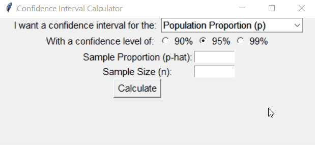
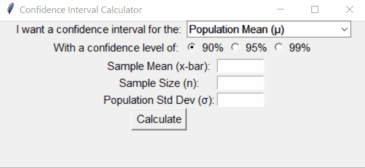

# Confidence Interval Calculator

> Quickly compute confidence intervals for population proportion and population mean

Confidence intervals are a common, but tedious, computation used in statistical inference.
This is a GUI application built with Python and the tkinter library. It lets users compute confidence intervals at the 90%, 95% and 99% confidence level for population proportion and population mean.

